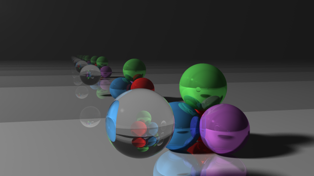
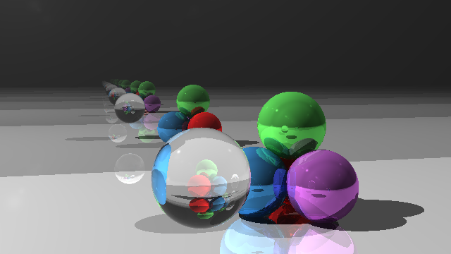
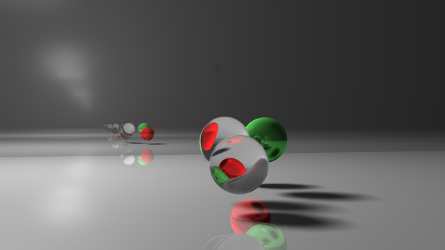

# Ray Tracing with Antialiasing, Soft Shadows and Refraction

### Antialiasing
Each pixel now shoots out 4 * 4 stratified random rays. Then the color of each pixel is set to the average of the ray-colors that are picked up by those 16 rays along the way.




### Soft Shadows from Area Lights
Point lights only cast sharp shadows, while area lights can give soft shadows. The way I implemented this is by tracing 32 rays to each area light with Monte Carlo sampling. Then take the average of those 32 shadow/no-shadow colors as the new shadow color, unlike just test whether the hit is in shadow or not.


### Refraction by Dielectrics
Lights can be refracted by dielectrics, such as glass, diamond, water, etc. The angle by how much a light is refracted is determined by the refractive indices of the two media across which the light is traveling.

To test whether the ray of light is moving into or out from an object, I assumed that the normal vector always points outwards. So by taking the dot product between ray direction and the normal and test whether the value is positive or negative, we can know how to refract the light.



### Animation
I borrowed what is used in Assignment 7 to do the transformations on the objects. Since I am only moving spheres, we can simply transform the center of the spheres. The algorithm is based on Assignment 3, so it is run on CPU, which is very slow given that it does not fork out other processes and only run on single core. The way I circumvented the problem is that I jumped forward in the animation for-loops running only transformations and skipping rendering. By doing this, I can parallelize multiple processes by scheduling them on different cores starting at different animation times.

[](http://www.youtube.com/watch?v=Mm3lITDwxWA "Ray Tracing Video")

### How to build and run
Build:
```
mkdir build_release
cd build_release
cmake -DCMAKE_BUILD_TYPE=Release ..
make
```

Run the executable:
```
./raytracing
OR
./raytracing PATH/TO/JSON/FILE
```

Based on https://github.com/alecjacobson/computer-graphics-ray-tracing, we include:
1. lib
2. shared
